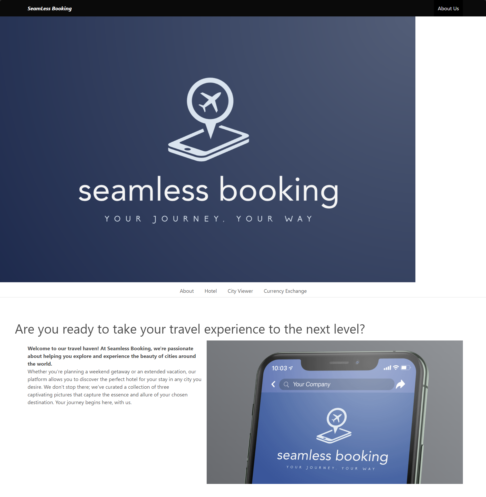
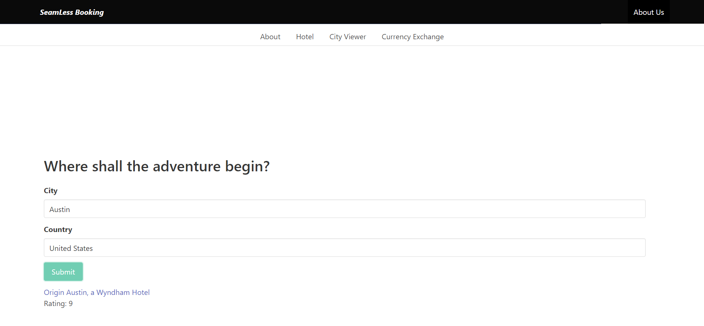
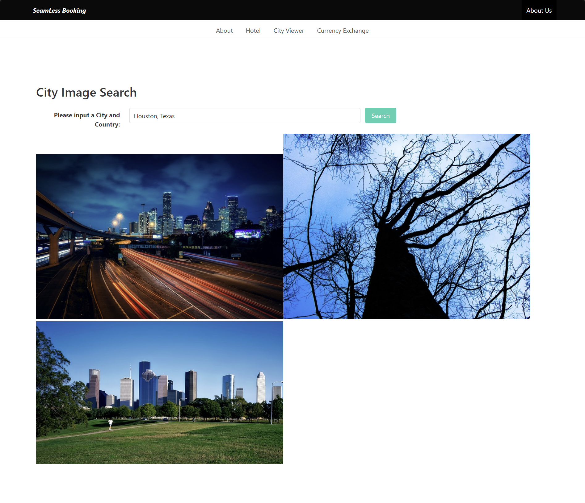
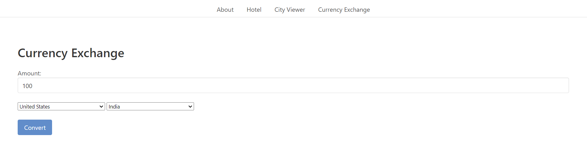

# Seamless Booking - Travel Project


At Seamless Booking, we're passionate about helping travelers like you create unforgettable journeys with ease and efficiency. Say goodbye to the days of scrambling through multiple tabs, endless spreadsheets, and sticky notes – we've simplified the art of travel planning.

##  Table of Contents 

- [User Story](#user-story)
- [Features](#features)
- [Technologies Used](#technologies-used)
- [Startup and Installation](#startup-and-installation)
- [Screenshot](#screenshot)
- [Review](#review)
- [Sources](#sources)


## User Story

```
AS A traveler
I WANT to see the information about a city.
I WANT to see hotels within the city.
I WANT to see a currency exchanger.
SO THAT I can plan a trip accordingly
```

## Features

- **Simple Navigation menu**: Navigate through sections of the website
- **Home Section**: Navigate through sections of the website
- **Destinations Section**: Navigate through sections of the website
- **Activities Section**: Navigate through sections of the website
- **Contact Us Form**: Navigate through sections of the website

## Technologies Used

- HTML5
- CSS
- Bulma CSS Framework
- Javascript
- LocalStorage
- Best Booking.com API
- Pixabay Image search API
- Herokuapp Currency Exchange API

## Startup and Installation

1. **Clone the Repository**

Git clone https://github.com/Deazymat/travel-project.git

2. **Navigate to Project Folder**:

cd Travel-Project

3. **Open in browser**

Open index.html

------------
As a user of the site, from the deployed page, no installation is required. As long as user has connection to stable inernet they will be able to interact with the site completely. 

## Screenshots

Landing Screen


Hotel Search


City Viewer


Currency Exchange


Presentation Demo Slide
 


## Review 
* Use a CSS framework other than Bootstrap.

* Be deployed to GitHub Pages.

* Be interactive (i.e: accept and respond to user input).

* Use at least two server-side APIs.

* Does not use alerts, confirms, or prompts (use modals).

* Use client-side storage to store persistent data.

* Be responsive.

* Have a polished UI.

* Have a clean repository that meets quality coding standards (file structure, naming conventions, follows best practices for class/id-naming conventions, indentation, quality comments, etc.).

* Have a quality README (with unique name, description, technologies used, screenshot, and link to deployed application). 

## Sources

* https://www.youtube.com/watch?v=NFToND6x_nI
* https://www.youtube.com/watch?v=I6nuWeylMYM
* https://bulma.io/documentation/overview/modifiers/
* https://bulma.io/documentation/components/navbar/
* https://www.geeksforgeeks.org/bulma-navbar-burger/ 
* https://herotofu.com/solutions/forms-library/bulma/simple-contact-form
* https://bulma.io/documentation/form/general/ 
* https://looka.com/editor/149032190 (logo creator)
* https://www.exchangerate-api.com/ 
(Note: Exchange rates might not be 100% accurate. Value received with API shows a difference of 0-15 cents compared to Google)
* https://developer.mozilla.org/en-US/docs/Web/JavaScript/Reference/Statements/async_function
* https://developer.mozilla.org/en-US/docs/Web/API/Document/createElement